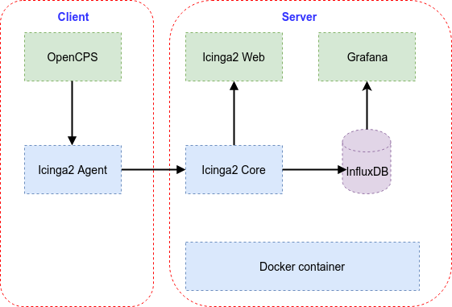

# Monitoring tools for OpenCPS (Icinga2, InfluxDB and Grafana)

## Cài đặt trên Server
* B1. Cài đặt Docker và Docker Compose
  * Thực hiện như hướng dẫn trên trang chủ của Docker tại đây: https://docs.docker.com/install/linux/docker-ce/ubuntu/ 
  * Và tại đây: https://docs.docker.com/compose/install/#install-compose
* B2. Lấy source code của bộ công cụ từ GitHub
  * git clone https://github.com/latuannetnam/opencps-monitor.git
  * Thư mục trên server sẽ là: opencps-monitor
* B3. Khởi động hệ thống giám sát
  * cd opencps-monitor
  * ./start.sh
* Truy nhập vào Icinga2 Web: http://{server_ip}/icingaweb2/dashboard (server_ip: địa chỉ IP của server. User/pass là: icingadmin/icinga)
* Truy nhập vào Grafana: http://{server_ip}:3000 (User/pass: admin/admin)
## Cài đặt trên Client
* B1. Lấy source code của bộ công cụ từ GitHub
  * git clone https://github.com/latuannetnam/opencps-monitor.git
  * Thư mục trên client sẽ là: opencps-monitor
* B2. Cài đặt Agent
  * cd opencps-monitor/client
  * sudo ./client_install.sh
* B3. Cấu hình Agent
  * cd opencps-monitor/client
  * ./client_setup.sh -h <master hostname> -i <master ip address>
  * Trong đó: master_hostname là hostname của server (ngầm định hostname=icinga2)
  * master ip address: là địa chỉ IP của server
* B4. Cấu hình MySQL
  * cd opencps-monitor/client
  * mysql -u root < mysql_setup.sql
* B5. Cấu hình Tomcat/Liferay
  * cd opencps-monitor/client
  * cat setenv.sh.template >> {TOMCAT_HOME}/bin/setenv.sh
  * Trong đó: TOMCAT_HOME là thư mục cài đặt Tomcat của OpenCPS
  * cat portal-ext.properties >> {OPENCPS_HOME}/WEB-INF/classes/portal-ext.properties
  * Trong đó: OPENCPS_HOME là thư mục cài đặt ứng dụng OpenCPS (thông thường sẽ ở {TOMCAT_HOME}/webapps/ROOT
* B6. Cấu hình Agent trên server
  * Trên server: cd opencps-monitor/server
  * ./add_client.sh -h <client_host> -i <client_ip> -o <os_type>
  * Trong đó: client_host: hostname của client
  * client_ip: ip address của client
  * os_type: loại HĐH, chỉ chấp nhận 2 giá trị là Ubuntu và CentOS  
## Một số lệnh thường dùng
* build.sh: Build/Rebuild docker image
* start.sh/stop.sh: Bật/tắt docker service
* console.sh: truy nhập vào console của docker service  
